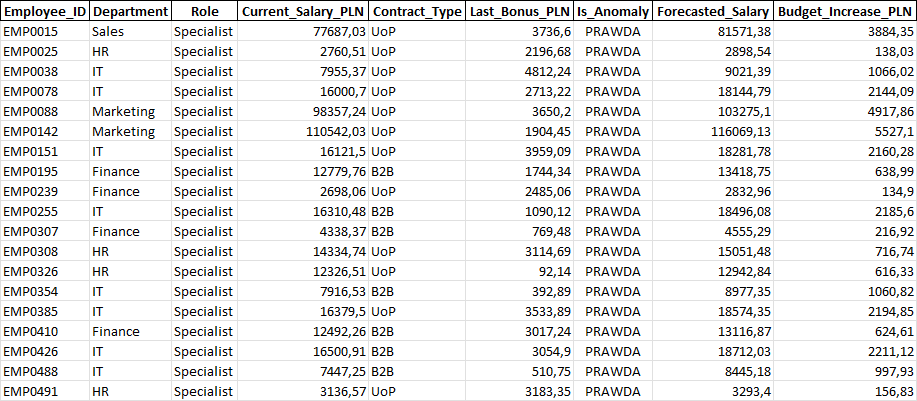
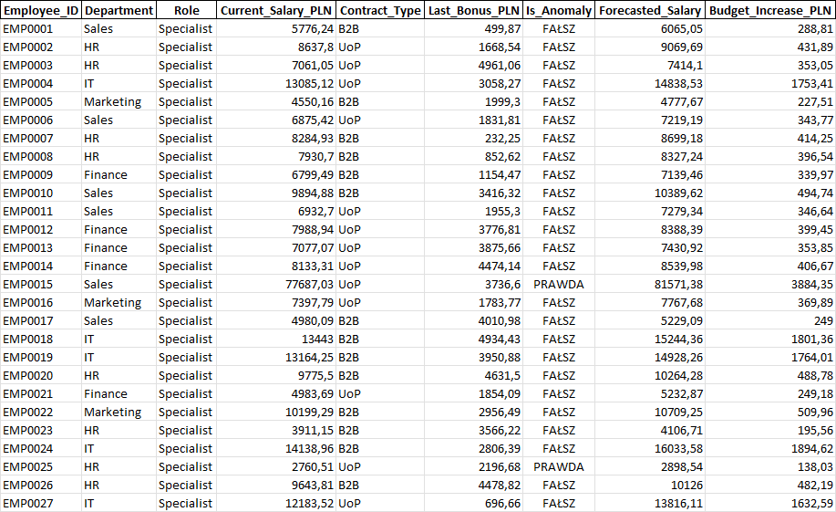
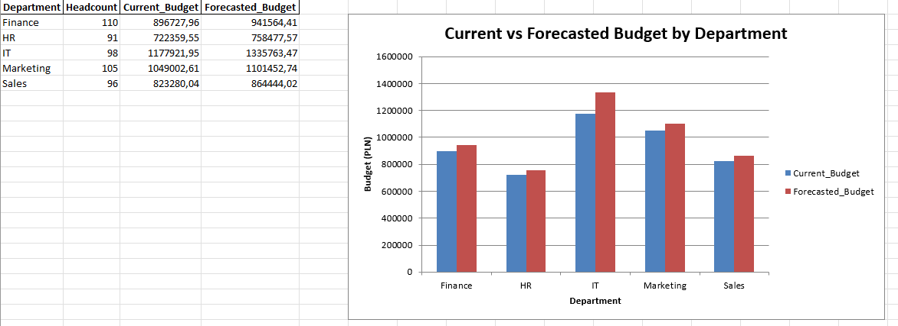

# 💼 HR Analytics: Total Rewards Pipeline & Anomaly Detector

## 📌 Project Overview
This synthetic Python project demonstrates an automated ETL (Extract, Transform, Load) pipeline tailored for HR Analytics and Total Rewards departments. It solves two highly common challenges in corporate HR: **automated budget forecasting** and **payroll anomaly detection**.

The pipeline processes raw employee data, applies statistical models to flag payroll errors, executes financial forecasting scenarios, and automatically generates a formatted, multi-sheet Excel report complete with business charts[cite: 1].

## 🛠️ Tech Stack
*   **Python:** pandas, numpy, logging
*   **Excel Automation:** xlsxwriter engine (for automated chart generation and formatting directly from Python)

## 🚀 Key Features & Business Problems Solved

### 1. AI-Powered Payroll Anomaly Detector
In large organizations, manual payroll exports often contain hidden errors (e.g., an extra zero added to a bonus). 
*   **How it works:** The script dynamically calculates the mean and standard deviation of salaries within each specific department[cite: 1]. It then computes the **Z-Score** for every employee[cite: 1]. 
*   **The Result:** Any salary deviating significantly from the departmental norm (Z-Score > 2 or < -2) is automatically flagged as an `Anomaly` (`PRAWDA`) for HR review[cite: 1].

### 2. Headcount & Salary Cost Forecaster
Manually calculating next year's budget across hundreds of employees with different contract types and department-specific raises is prone to error.
*   **How it works:** The script applies financial scenarios to the cleaned dataset (e.g., a baseline 5% inflation adjustment across the board, with an additional 8% strategic adjustment for the IT department)[cite: 1].
*   **The Result:** An automated calculation of the forecasted salary and the exact budget increase required per employee[cite: 1].

## 📊 Automated Excel Reporting
Instead of just printing numbers to a terminal, the script uses `xlsxwriter` to automatically generate a highly readable, management-ready Excel file (`HR_Total_Rewards_Forecast.xlsx`). 

The output includes isolated data sheets for anomalies and forecasts, as well as an aggregated **Budget Summary** dashboard with a dynamically generated column chart comparing the Current vs. Forecasted Budget by Department[cite: 1].

